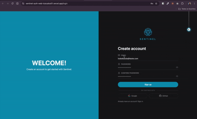

# Sentinel Auth Web

SPA de autenticação (registro, login, área autenticada e listagem de usuários restrita a admin) que consome o backend [`sentinel-auth-api`](https://github.com/LuisCarlos01/sentinel-auth-api) via REST/JWT. Sem servidor próprio: todo o estado de sessão vive no browser.

**Produção:** https://sentinel-auth-web-luiscalos01.vercel.app

<p align="center">
  
</p>

<p align="center">
  
  
  
  
  
  
  
</p>

## Arquitetura

- **SPA client-only, sem SSR**. Não há requisito de SEO por trás de um login wall, então um servidor Next.js só adicionaria complexidade sem benefício (detalhe em [ADR-0001](docs/adr/0001-react-vite-spa-over-nextjs.md)).
- **Access token e refresh token só em memória** (React Context/refs), nunca em `localStorage`/`sessionStorage`. Isso limita o que um XSS conseguiria roubar, já que nada sobrevive a um reload. O refresh token chega no corpo da resposta de `login`/`refresh`, não só via cookie (que é `SameSite=Strict` e não atravessa domínios diferentes em produção). Detalhes em [ADR-0002](docs/adr/0002-in-memory-access-token-cookie-refresh.md).
- **Autorização de admin é decidida no backend, não no cliente**. O frontend decodifica o JWT só para mostrar ou esconder o link de admin na UI; a listagem de usuários (`GET /api/v1/users`) responde `401`/`403` de verdade se o token não tiver a role certa.
- **Um único ambiente de produção, sem staging**. Projeto de portfólio com um único backend real implantado ([ADR-0004](docs/adr/0004-single-production-environment.md)).

Contrato completo dos endpoints consumidos: [`docs/integrations/sentinel-auth-api-web.md`](docs/integrations/sentinel-auth-api-web.md). Vocabulário do domínio: [`CONTEXT.md`](CONTEXT.md).

## Rodando localmente

Pré-requisito: [`sentinel-auth-api`](https://github.com/LuisCarlos01/sentinel-auth-api) rodando (via `docker compose up -d` nesse outro repo, porta `8080`).

```bash
pnpm install
pnpm dev
```

O Vite faz proxy de `/api/v1` para `localhost:8080` em dev (`vite.config.ts`), então as chamadas saem same-origin sem depender de CORS configurado no backend.

Outros scripts:

```bash
pnpm build          # typecheck (tsc -b) + build de produção
pnpm lint           # oxlint
pnpm format         # prettier --write
pnpm format:check   # prettier --check
```

## Estrutura

```
src/
  auth/        # cliente HTTP, AuthContext (sessão em memória), decode de JWT
  components/  # UI da tela de login/registro (desktop, mobile, tema)
  pages/       # rotas: /login, / (dashboard), /admin/users
  theme/       # tema claro/escuro
docs/adr/      # decisões de arquitetura registradas
```
